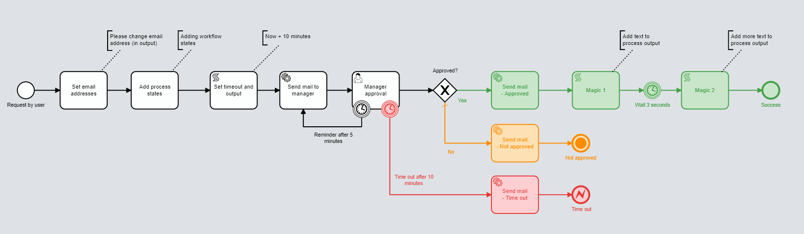
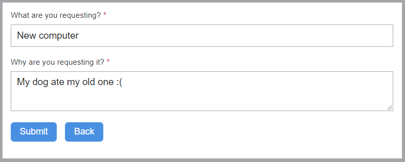
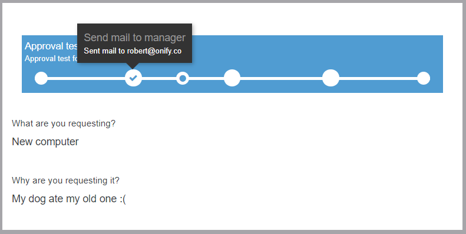
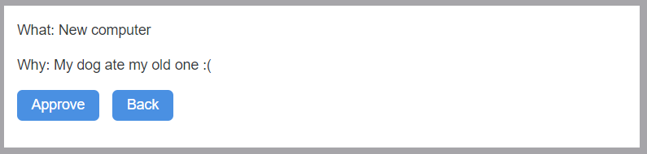
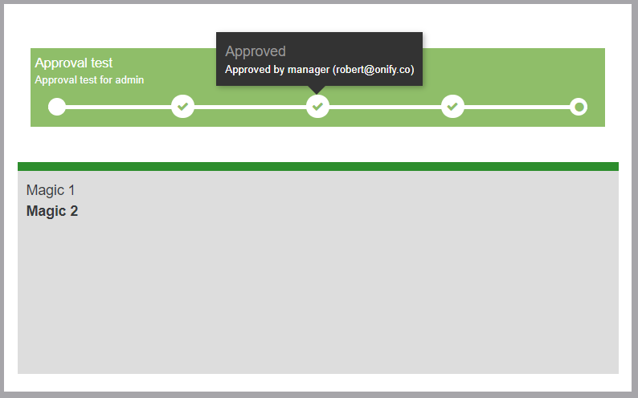
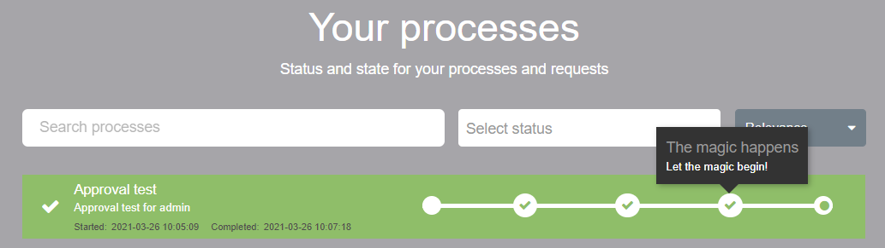

# Onify Blueprint: Approval example

[](https://www.repostatus.org/#wip)

## Screenshots

### Flow



### Request form 

Main form



Result form



### Approval form 

Main form



Result form



### Process



## Requirements

* Onify Hub v2
* Onify Flow license
* Camunda Modeler 4.4 or later 
* Configured email settings in Onify Hub

## Included

* 2 x Forms (config + resources)
* 1 x Workflow including Flow (config + resource)

## Setup

1. Resources
2. Import configuration
3. Modify Flow (BPMN)

### Resources

Copy `./resources/*` to Onify Hub resources folder 

### Configuration

Import `request` form configuration:

```bash
curl -X POST "<ONIFY-HUB-API-URL>/api/v2/setup/database/config/import" -H "accept: application/json" -H "authorization: <ONIFY-HUB-API-TOKEN>" -H "Content-Type: application/json" -d "@form_request.json
```

Import `approval` form configuration:

```bash
curl -X POST "<ONIFY-HUB-API-URL>/api/v2/setup/database/config/import" -H "accept: application/json" -H "authorization: <ONIFY-HUB-API-TOKEN>" -H "Content-Type: application/json" -d "@form_approval.json
```

Import `approval-example` workflow configuration:

```bash
curl -X POST "<ONIFY-HUB-API-URL>/api/v2/setup/database/config/import" -H "accept: application/json" -H "authorization: <ONIFY-HUB-API-TOKEN>" -H "Content-Type: application/json" -d "@workflow.json
```

### Modify Flow (BPMN)

Open `approval-example.bpmn` in editor change the following.

* Replace `http://localhost:3000` with correct URL for Onify Hub
* Replace `user@acme.com` with requester/user mail address
* Replace `manager@acme.com` with manager mail address

### Run 

Go to `<ONIFY-HUB-APP-URL>/form/request` and follow the instructions :-)

## Support

* Community/forum: https://support.onify.co/discuss
* Documentation: https://support.onify.co/docs
* Support and SLA: https://support.onify.co/docs/get-support

## License

This project is licensed under the MIT License - see the [LICENSE](LICENSE) file for details.
